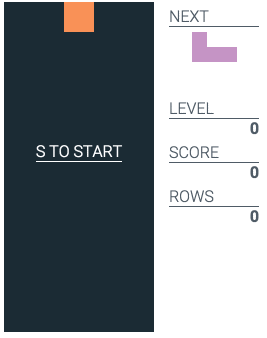

# react-tetris
React &amp; Redux implementation of the famous Tetris game. [Play the demo!](http://gcedo.github.io/react-tetris/)

## Keys
- `s` ➜ start game
- `arrow down` ➜  move down
- `arrow left` ➜ move left
- `arrow right` ➜ move right
- `space bar` ➜ rotate

## Stack
- [React](https://github.com/facebook/react)
- [redux](https://github.com/rackt/redux) with [redux-thunk](https://github.com/gaearon/redux-thunk)
- [Babel](https://github.com/babel/babel) stage 0
- [jsxstyle](https://github.com/petehunt/jsxstyle)
- [lodash](https://github.com/lodash/lodash)
- [Google webfont loader](https://github.com/typekit/webfontloader)

